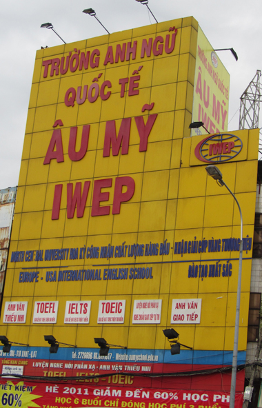
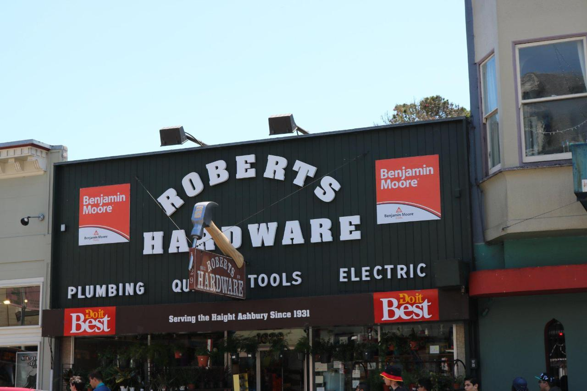
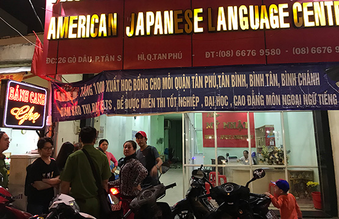
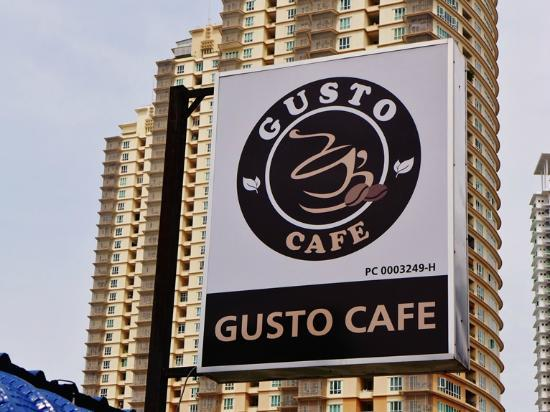
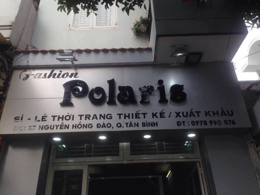
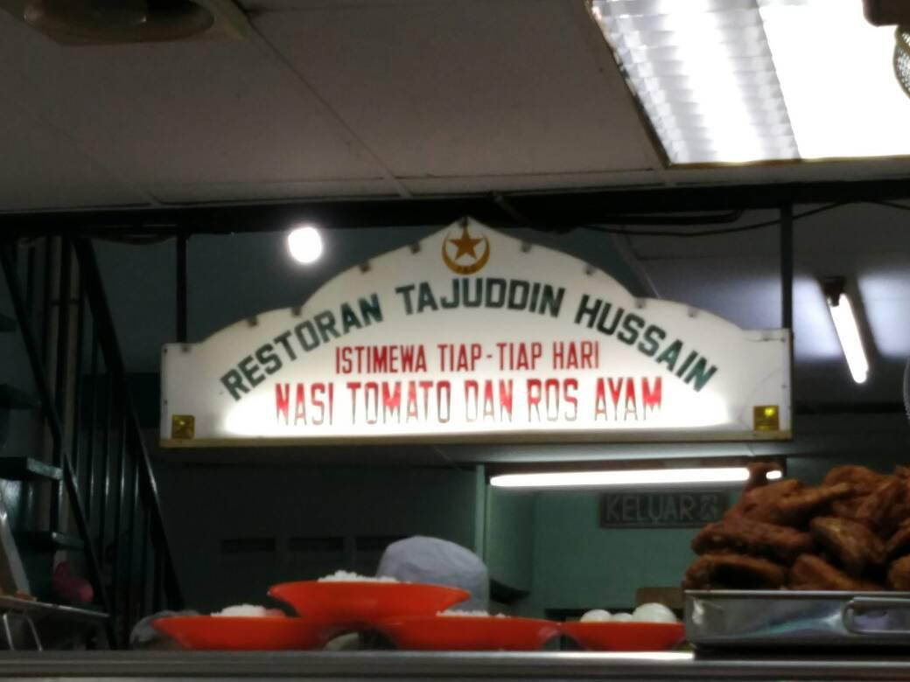

# SignboardText
> Scene text detection and recognition have attracted much attention in recent years because of their potential applications. Detecting and recognizing texts in images may suffer from scene complexity and text variations. Some of these problematic cases are included in popular benchmark datasets, but only to a limited extent. In this work, we investigate the problem of scene text detection and recognition in a domain with extreme challenges. We focus on in-the-wild signboard images in which text commonly appears in different fonts, sizes, artistic styles, or languages with cluttered backgrounds. We first contribute an in-the-wild signboard dataset with 79K text instances on both line-level and word-level across 2,104 scene images. We then comprehensively evaluated recent state-of-the-art (SOTA) approaches for text detection and recognition on the dataset. By doing this, we expect to realize the barriers of current state-of-the-art approaches to solving the extremely challenging issues of scene text detection and recognition, as well as their applicability in this domain. 

This repository includes the code and data links mentioned in our papers, encompassing all the training data, evaluation scripts, and results utilized in our research.

<p align="center">
  
  
  
  
  
  
</p>


<style type="text/css">
.tg  {border-collapse:collapse;border-spacing:0;}
.tg td{border-color:black;border-style:solid;border-width:1px;font-family:Arial, sans-serif;font-size:14px;
  overflow:hidden;padding:10px 5px;word-break:normal;}
.tg th{border-color:black;border-style:solid;border-width:1px;font-family:Arial, sans-serif;font-size:14px;
  font-weight:normal;overflow:hidden;padding:10px 5px;word-break:normal;}
.tg .tg-c3ow{border-color:inherit;text-align:center;vertical-align:top}
.tg .tg-0pky{border-color:inherit;text-align:left;vertical-align:top}
</style>
<table class="tg" align="center">
<thead>
  <tr>
    <th class="tg-0pky">Dataset</th>
    <th class="tg-c3ow">IC15</th>
    <th class="tg-c3ow">TotalText</th>
    <th class="tg-c3ow">VinText</th>
    <th class="tg-c3ow">Ours</th>
    <th class="tg-c3ow">Total</th>
  </tr>
</thead>
<tbody>
  <tr>
    <td class="tg-0pky">No. of <br>signboard<br>images</td>
    <td class="tg-c3ow">2</td>
    <td class="tg-c3ow">411</td>
    <td class="tg-c3ow">516</td>
    <td class="tg-c3ow">1175</td>
    <td class="tg-c3ow">2104</td>
  </tr>
  <tr>
    <td class="tg-0pky">No. of <br>text instances</td>
    <td class="tg-c3ow" colspan="3">20261</td>
    <td class="tg-c3ow">59588</td>
    <td class="tg-c3ow">79849</td>
  </tr>
</tbody>
</table>

## Download
To download the data, please send a request email to thuyentd@uit.edu.vn and tell us which school you are affiliated with. And by downloading this dataset, USER agrees:
> * to use this dataset for research or educational purposes only;
> * to not distribute or part of this dataset in any original or modified form;
> * and to cite our github repo whenever this dataset are employed to help produce published results.

```
|-- annotations.json
|-- annotations_line.json
|-- detection
|-- images
`-- recognition
    |-- images
    `-- labels
```

## Detection
### Main results:
The results can be found in the `eval/det_results` directory and can be reproduced using the scripts in the `src/` folder. To verify the accuracy of the results marked with the symbol † (in supplemental tables), utilize the evaluation script provided in the `eval/detections/eval_det` directory.
| Methods     | **Signboard** |           |        | **ICDAR2015** |           |           | **TotalText** |           |        |Reference| Link to model|
|-------------|:-------------:|:---------:|:------:|:-------------:|:---------:|:---------:|:-------------:|:---------:|:------:|:------:|:------:|
|             |     Recall    | Precision | H-mean |     Recall    | Precision |   H-mean  |     Recall    | Precision | H-mean |||
| TextSnake   |         57.06 |     60.67 |  58.56 |      84.9     |    80.4   |    82.6   |      84.9     |    80.4   |  82.6  |[link](https://github.com/open-mmlab/mmocr/blob/main/configs/textdet/textsnake/README.md)|[link](https://drive.google.com/file/d/1e14mRto25VnECjEItai-TobPzEWPXcT1/view?usp=drive_link)|
| PANet       |         71.92 |     78.98 |  75.14 |      77.8     |    82.9   |    80.3   |       81      |    89.3   |   85   |[link](https://github.com/open-mmlab/mmocr/blob/main/configs/textdet/panet/README.md)|[link](https://drive.google.com/file/d/1e7f0KridHbcGGCq-DMcSZvVY-SkYAaGW/view?usp=drive_link)|
| PSENet      |         78.09 |     82.06 |  79.94 |      84.5     |   86.92   |   85.69   |     77.96     |   84.02   |  80.87 |[link](https://github.com/open-mmlab/mmocr/blob/main/configs/textdet/psenet/README.md)|[link](https://drive.google.com/file/d/1e1KRPSY60WDT1wwmJdSlFkZmAKlvLW8u/view?usp=drive_link)|
| ABCNet v1   |         64.48 |     76.26 |   69.4 |   86.33 [1]   | 88.76 [1] | 87.53 [1] |     50.48     |   66.53   |  57.4  |[link](https://github.com/aim-uofa/AdelaiDet)|[link](https://drive.google.com/file/d/17ulJ05Eo6UkiU-ziMfE6C8ayat5nkEmT/view?usp=drive_link)|
| DBNet       |          60.7 |     73.39 |  66.09 |     82.76     |   87.44   |   85.04   |      82.5     |    87.1   |  84.7  |[link](https://github.com/open-mmlab/mmocr/blob/main/configs/textdet/dbnet/README.md)|[link](https://drive.google.com/file/d/1eVovAe1WZsrnnLrZSvIk1oAQ-YzddRQe/view?usp=drive_link)|
| DRRG        |         50.82 |      71.6 |  59.22 |     84.69     |   88.53   |   86.56   |     84.69     |   88.53   |  86.56 |[link](https://github.com/open-mmlab/mmocr/blob/main/configs/textdet/drrg/README.md)|[link](https://drive.google.com/file/d/1eLyTayYQUqrbWaiTbxmhNBwcl4XO7AX4/view?usp=drive_link)|
| FCENet      |         70.38 |     75.93 |   72.9 |      82.6     |    90.1   |    86.2   |     88.34     |   82.43   |  85.28 |[link](https://github.com/open-mmlab/mmocr/blob/main/configs/textdet/fcenet/README.md)|[link](https://drive.google.com/file/d/1eK6R00gmhMahphcZ3lssx_cntziBTCgT/view?usp=drive_link)|
| ABCNet v2   |         64.32 |     77.66 |  69.95 |      90.4     |     86    |    88.1   |      90.2     |    84.1   |   87   |[link](https://github.com/aim-uofa/AdelaiDet)|[link](https://drive.google.com/file/d/1eGRZVsvCUZ6VjMmKszG4e_rEH4cieu1f/view?usp=drive_link)|
| DPText-DETR |         60.46 |     90.56 |  72.07 |     90.93     |   41.61   |   57.09   |      86.4     |    91.8   |   89   |[link](https://github.com/ymy-k/DPText-DETR)|[link](https://drive.google.com/file/d/1eUY9Em-4YJTJfSs2kOFDvI-5dUIuIL6b/view?usp=drive_link)|
| DeepSolo    |         63.11 |     91.05 |   74.2 |     92.54     |   87.19   |   89.79   |     93.19     |   84.64   |  88.72 |[link](https://github.com/ViTAE-Transformer/DeepSolo)|[link](https://drive.google.com/file/d/1eMrNSj36YkK0_qjcdP-lV4MPxcgFbFcB/view?usp=drive_link)|


### Running the scripts
For examples:
python
```
python eval_det/script.py –g=gt/gt.icdar.zip –s=res/occluded/psenet/det.psenet-pretrained-icdar2015.rotatebox.zip –o=./ -p={\"IOU_CONSTRAINT\":0.4}
```


### Model usage:
- We use the following methods for predicting and get the results:
    + MMOCR `src/mmocr`: TextSnake(CTW1500-Resnet), PANet(ICDAR2015), PSENet (CTW1500-Resnet50), DBNet (ICDAR2015), DRRG(CTW1500-Resnet50), FCENet(CTW1500-Resnet50);
    + ABCNet v1 (v1-icdar2015-finetune), ABCNet v2 (v2-icdar2015-finetune) both are from `src/AdelaiDet/`;
    + DPText-DETR `src/DPText-DETR` (Total-Text	Res50) , DeepSolo (ViTAEv2 Synth150K+Total-Text+MLT17+IC13+TextOCR) `src/DeepSolo`

## Recognition

Similar to text detection, the results are stored in the `eval/rec_results` directory. For this section, re-evaluation is focused on results marked with the symbol † (in supplemental tables).

For examples:
python
```
python recognition/eval_rec.py --gt_file rec_gts/coco.txt --pred_file rec_results/results/starnet/coco.txt
```
### Main results:
| Method                | **Signboard** | **IC13** | **IC15** | **ToTalText** | **Coco-text** ||
|-----------------------|:-------------:|:--------:|:--------:|:-------------:|:-------------:|:-------------:|
| CRNN                  |     39.04     | 89.2 [2] | 64.2 [2] |     49.48     |     32.46     |[link](https://drive.google.com/file/d/1qiA71LzIcxZWBSMQyOriqJPhKgqVLYHr/view?usp=drive_link)|
| STAR-Net              |      47.4     | 91.5 [2] | 70.3 [2] |     35.07     |     24.14     |[link](https://drive.google.com/file/d/1dpCjmE1KK6QVaJ2cSS-eza-KN185c-cd/view?usp=drive_link)|
| Rosetta               |     46.12     |  89 [2]  | 66.0 [2] |     15.81     |      9.3      |[link](https://drive.google.com/file/d/1dtCmgjHh3IMqKungeaepPRmEMffAAmMg/view?usp=drive_link)|
| SAR                   |     57.96     |  94 [5]  | 78.8 [5] |     56.88     |    66.8 [5]   |[link](https://drive.google.com/file/d/1dr6njFxV6GiXDGXp3a4nKL3D76sQ6bcO/view?usp=drive_link)|
| Paddle OCR            |     11.56     |   94.09  |   69.96  |      66.2     |      51.3     |[link](https://github.com/PaddlePaddle/PaddleOCR)|
| VietOCR-TranformerOCR |     68.57     |   89.85  |   60.13  |     56.07     |     39.59     |[link](https://drive.google.com/file/d/1dnTX5kG6l2fJ5ULWgTNgaAXiBRrZdnG1/view?usp=drive_link)|
| SATRN                 |     56.34     | 94.1 [4] |  79 [4]  |     57.38     |      23.6     |[link](https://drive.google.com/file/d/1dpaS9YRmYagvkH-R5pPc5RZB90ZNjezK/view?usp=drive_link)|
| ViTSTR                |     67.13     | 94.2 [3] | 78.7 [3] |     58.47     |    56.4 [3]   |[link](https://drive.google.com/file/d/1fVM2GQx770GRHOSRG84I-rKKrqALJwNS/view?usp=drive_link)|
| ABINet                |     66.07     | 95.0 [3] | 79.1 [3] |     77.37     |    57.1 [3]   |[link](https://drive.google.com/file/d/1dzOZ9ABInuhbjOO3W2oBTCGas0uDYQas/view?usp=drive_link)|
| PARSeq                |     68.55     | 96.2 [3] | 82.9 [3] |     71.51     |     64 [3]    |[link](https://drive.google.com/file/d/1dv07-ti8mUGIM5QJWSXF4423YzQbw4LT/view?usp=drive_link)|


### Training:
- Firstly, we cropped the images from dataset anh prepare using `create_lmdb_dataset.py`;
- Secondly, then for each the methods:
    + CRNN, SAR, SATRN and SVTR  `src/DPText-DETR`;
    + STARNet `PaddleOCR`;
    + VietOCR `src/vietocr`; 
    + etc...
